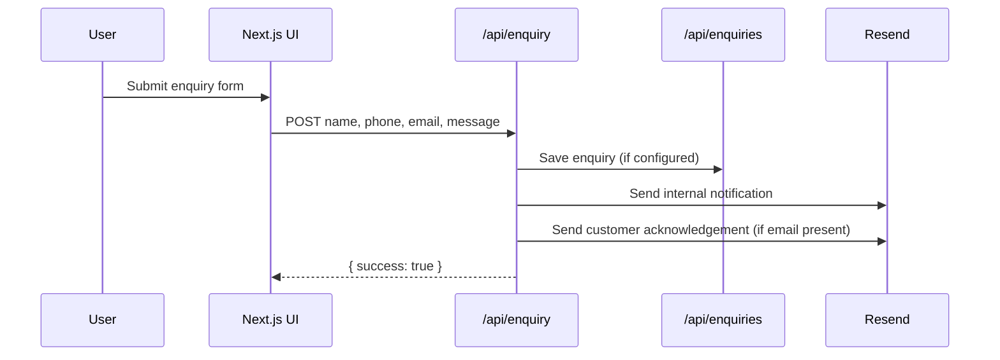

# Limac Website — Development Architecture Summary

_Last updated: 2026-03-15_

## 1) Solution Overview

This project is a **Next.js 14 (App Router)** website for Limac Power Tech with:
- Marketing pages and product pages
- Enquiry form + email notification flow
- AI chatbot (Anthropic Claude)
- Payload **CMS (Content Management System)** backend configuration (Products, BlogPosts, Enquiries, Media, Users)
- CMS-backed product/spec/image rendering via Payload REST + MongoDB

---

## 2) High-Level Architecture Diagram

```mermaid
flowchart TD
    U[Website Visitor] --> N[Next.js App Router]

    N --> PAGES[Site Pages<br/>Home / Products / Blog / Contact]
    N --> CHATAPI[/api/chat]
    N --> ENQAPI[/api/enquiry]
    N --> PAYREST[/api/* Payload REST]

    CHATAPI --> ANTH[Anthropic Claude API]

    ENQAPI --> RES[Resend Email API]
    ENQAPI --> PAYREST

    PAYREST --> PAYCFG[Payload Config]
    PAYCFG --> MDB[(MongoDB Atlas)]

   PAGES --> PAYHELP[src/lib/payload.ts<br/>CMS fetch helpers]
   PAGES -. static fallback for non-product content .-> CONST[src/lib/constants.ts]
```

---

## 3) Runtime Request Flow



---

## 4) Module Map (What each module does)

## App Shell
- `src/app/layout.tsx` — Global HTML layout, SEO metadata, injects Navbar/Footer/WhatsApp/Chatbot.
- `src/app/globals.css` — Global style tokens, utility styles, card hover behavior.
- `src/app/page.tsx` — Homepage section composition.

## Site Pages
- `src/app/(site)/about/page.tsx` — Company profile page.
- `src/app/(site)/products/page.tsx` — Product listing + category filter.
- `src/app/(site)/products/[slug]/page.tsx` — Product detail view + specs + enquiry form.
- `src/app/(site)/blog/page.tsx` and `src/app/(site)/blog/[slug]/page.tsx` — Blog listing and blog details.
- `src/app/(site)/contact/page.tsx`, `solutions`, `careers`, `privacy-policy`, `terms` — Business and legal pages.

## API Endpoints
- `src/app/api/chat/route.ts` — Streams AI responses using Anthropic SDK and Limac system prompt.
- `src/app/api/enquiry/route.ts` — Validates form, stores enquiry (Payload), sends emails via Resend.
- `src/app/api/[...slug]/route.ts` — Payload REST passthrough handlers (GET/POST/PATCH/etc.).

## UI Components
- `src/components/layout/*` — Navigation/footer/mobile drawer.
- `src/components/home/*` — Homepage sections (hero, categories, featured products, blogs, etc.).
- `src/components/forms/EnquiryForm.tsx` — Client-side validated form submission.
- `src/components/chat/ChatBot.tsx` — Floating chatbot widget with streaming UX.
- `src/components/common/*` — Reusable UI primitives (`Badge`, `SectionHeader`, `RevealOnScroll`, etc.).

## Domain + Data Layer
- `src/lib/constants.ts` — Active static business/product/blog data source.
- `src/lib/types.ts` — Shared domain interfaces.
- `src/lib/utils.ts` — Shared utility functions.
- `src/lib/payload.ts` — Active helper layer for CMS product reads + mapping + safety guards.

## CMS Layer
- `src/payload/payload.config.ts` — Payload root config (collections, db adapter, editor).
- `src/payload/collections/Products.ts` — Product schema.
- `src/payload/collections/BlogPosts.ts` — Blog schema.
- `src/payload/collections/Enquiries.ts` — Enquiry schema.
- `src/payload/collections/Media.ts` — Media upload settings.
- `src/payload/collections/Users.ts` — Auth-enabled admin users.
- `payload.config.ts` — Root re-export for Payload runtime compatibility.

## Static Assets
- `public/logo.webp` — Current company logo used in Navbar/Footer/MobileMenu.

---

## 5) Technology Stack

| Layer | Technology | Purpose |
|---|---|---|
| Frontend framework | Next.js 14 (App Router) | SSR/SSG routing and page rendering |
| UI | React 18 + TypeScript | Component architecture and type safety |
| Styling | Tailwind CSS | Utility-first styling with Limac theme tokens |
| Icons | lucide-react | Consistent iconography |
| Forms | react-hook-form | Lightweight form state + validation |
| AI | @anthropic-ai/sdk | Claude chat assistant integration |
| Email | resend | Transactional notifications for enquiries |
| CMS (Content Management System) | payload v3 | Content management and collections |
| Database | MongoDB Atlas (via @payloadcms/db-mongodb) | Persistent data storage |
| Rich text | @payloadcms/richtext-lexical | Blog/editor content blocks |

---

## 6) Environment Variables

Defined in `.env.example`:
- `ANTHROPIC_API_KEY`
- `RESEND_API_KEY`
- `PAYLOAD_SECRET`
- `PAYLOAD_URL`
- `PAYLOAD_API_KEY`
- `MONGODB_URI`
- `NEXT_PUBLIC_SITE_URL`

---

## 7) Operation Guide

## A) New Product Launch (CMS-First Active Path)

Products now render from Payload CMS (MongoDB). Launch steps are:

1. Open Payload Admin panel.
2. Go to **Products** collection.
3. Create a new product with these required/important fields:
   - `name`, `slug`, `category`, `shortDescription`
   - `voltage`, `capacity`, `cycleLife`, `warranty`
   - `specs[]` (for weight, dimensions, operating temperature, application)
   - `image` (upload/select from Media)
   - `isFeatured` (homepage visibility), `isActive` (publish toggle)
4. Ensure `category` is one of:
   - `solar-storage`, `motorcycle`, `12v-series`, `lifepo4-lighting`
5. Ensure `slug` is unique (used by `/products/[slug]`).
6. Run:
   - `npm run build`
7. Deploy.

### Product field template (Payload)

- Name: `12V 100AH LiFePO4 Solar Battery`
- Slug: `12v-100ah-lifepo4-solar-battery`
- Category: `solar-storage`
- Short Description: `High-performance solar storage battery...`
- Voltage: `12.8V`
- Capacity: `100AH`
- Cycle Life: `2000+ cycles`
- Warranty: `3 Years`
- Specs entries:
   - `Weight` → `11.5kg`
   - `Dimensions` → `330 × 172 × 215mm`
   - `Operating Temperature` → `-20°C to 60°C`
   - `Application` → `Solar Storage, Inverter Backup`
- Image: upload/select media
- Is Featured: `true` (if needed on homepage)
- Is Active: `true` (published)

---

## B) How to Update Product Specification

1. Open Payload Admin → **Products**.
2. Search product by `slug` or name.
3. Update fields directly:
   - Core fields (`voltage`, `capacity`, `cycleLife`, `warranty`)
   - `specs[]` rows (weight, dimensions, operating temperature, application)
4. Save the product.
5. (Optional) verify on `/products` and `/products/[slug]`.
6. Run:
   - `npm run build`
7. Deploy.

---

## C) How to Modify Product Image (CMS Operations)

### Current status
- Product cards and product details now render CMS media images when `image` is set.
- If image is missing, UI automatically falls back to battery icon placeholders.

### Current logo update path
- Company logo is file-based: `public/logo.webp`.
- Replace this file with new logo (same name), then run `npm run build`.

### Product image update steps
1. Open Payload Admin → **Media** and upload new image (or replace existing media item).
2. Open Payload Admin → **Products** → select target product.
3. Update `image` relation to the desired media record.
4. Save.
5. Refresh product pages to verify.

---

## D) Daily CMS Operation Workflow

Use this checklist for non-developer content operations:

1. Login to Payload Admin.
2. Open **Products** and apply update:
   - New product → create item.
   - Spec change → edit fields / `specs[]`.
   - Image change → upload/select in **Media**, then link in product.
3. Set publication flags:
   - `isActive = true` to publish.
   - `isFeatured = true` to show on homepage featured section.
4. Save and verify on:
   - `/products`
   - `/products/[slug]`
5. If content does not appear immediately, hard refresh browser.

---

## 8) CMS-Driven Architecture (Now Active)

Implemented state:

1. Product pages/components fetch via `src/lib/payload.ts`.
2. Product details/specs/images are sourced from Payload collections.
3. Chat prompt product summaries are generated from CMS product data.
4. Product publishing is controlled via `isActive` and homepage visibility via `isFeatured`.
5. Payload fetch helper safely skips CMS API requests when `MONGODB_URI` is missing/invalid (prevents repeated runtime API failures in local dev).

Result: product/spec/image updates do not require TypeScript code changes.

---

## 9) Runbook (Dev / Build / Start)

- Install dependencies: `npm install`
- Dev mode: `npm run dev`
- Production build: `npm run build`
- Production start: `npm run start`

If `ENOENT` occurs, ensure command is run inside project folder:
- `C:\Users\dilee\Git\Limac\limac-website`

---

## 10) Known Notes

- Next.js shows config warnings because Payload 3 Next wrapper expects newer Next config keys than v14 supports.
- `metadataBase` warning appears when metadata does not explicitly set `metadataBase` in page metadata.
- Build can fail on Windows if `.next\trace` is locked by another process; close running Node/Next process and rebuild.
- If dev logs show `Invalid scheme, expected connection string to start with "mongodb://" or "mongodb+srv://"`, set a valid `MONGODB_URI` in `.env.local`.
- `.env.example` is a template only; create `.env.local` with real values before using CMS routes.
